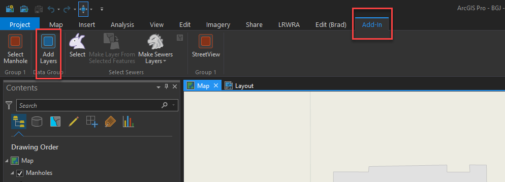
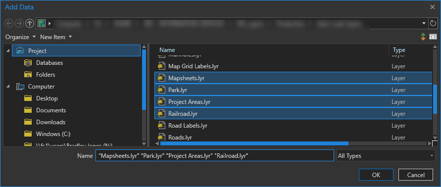

# ArcGIS-Pro-AddLayers
A simple ArcGIS Pro add-in that opens an "Add Data" dialog at a specified directory.  I maintain a network directory of **.lyr** and **.lyrx** files that are used by my organization's GIS users.  I created this so I can set the  **InitialLocation ** property of the **OpenItemDialog** class to the location on our network where the layer files are kept.  

This tool is also apart of the larger [LRWRA add-in](https://github.com/dogwoodgeo/ArcGIS-Pro-LRWRA) 

**Note**: I am a novice .Net developer, at best.  The add-in works, but feel free to let me know if you see any code that is "wrong" or just plain bad.  

## Bug 

The **InitialLocation** property no longer works as of **ArcGIS Pro 2.1**.  This had been identified by Esri as an issue to be addressed. See [GeoNet discussion](https://community.esri.com/thread/221947-initiallocation-propery-of-openitemdialog-class) .

## Getting Started

Clone or download the repository. Open Visual Studio 2015 or 2017, build solution, launch ArcGIS Pro and check the **Add-Ins** tab.




### Prerequisites

```
Language:					C#
Contributor:				Bradley Jones, bjones@dogwoodgeo.com
Organization:				Little Rock Water Reclamation Authority (LRWRA)
Org Site: 					https://git.lrwu.com/portal
Date:						5/20/2018
ArcGIS Pro:					2.2
ArcGIS Pro SDK:				2.2
Visual Studio:				2017, 2015
.NET Target Framework:		4.6.1
```

### How To Use Add-In

1. Build add-in (see **Getting Started**).

2. Launch ArcGIS Pro.

3. Go to **Add-In** tab.

4. Click **Add Layers** button.

5. Navigate to desired directory and select files to add.  Use Ctrl + Click to select multiple files.

   